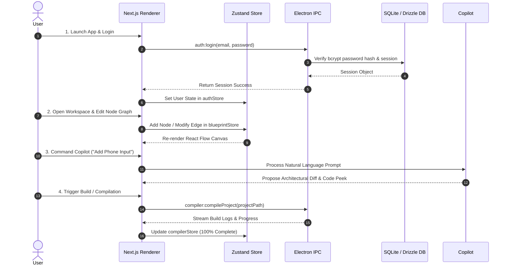

# CanvasCode — Project Architectural & Workflow Summary

## 1. Project Overview & Value Proposition

**CanvasCode** is a hybrid desktop visual full-stack IDE built with **Next.js 14 (App Router)** and **Electron v43**. It bridges visual UI design, backend visual node orchestration, AI-driven architectural code generation, and native code editing within a unified interface.

---

## 2. High-Level System Architecture

The application operates on an **Electron Main Process + Next.js Renderer (IPC Bridge)** architecture backed by a local **SQLite / Drizzle ORM** persistence layer and **Zustand** state management.

```mermaid
graph TD
    subgraph Renderer Process (Next.js 14 + React 18)
        UI[App Shell & Router]
        ZStores[Zustand Stores]
        Canvas[Canvas & Blueprint Engine]
        Copilot[AI Copilot Widget]
    end

    subgraph Preload Bridge
        API[window.canvasCodeAPI]
    end

    subgraph Main Process (Electron Core)
        IPC[IPC Handler Register]
        AuthSvc[Authentication Service]
        ProjSvc[Project & Storage Service]
        CompSvc[Compiler Service]
        DB[Better-SQLite3 + Drizzle ORM]
    end

    UI --> ZStores
    Canvas --> ZStores
    Copilot --> ZStores
    ZStores <--> API
    API <--> IPC
    IPC --> AuthSvc
    IPC --> ProjSvc
    IPC --> CompSvc
    AuthSvc --> DB
    ProjSvc --> DB
```

---

## 3. Technology Stack

| Layer | Technologies & Tools |
| :--- | :--- |
| **Desktop Shell** | Electron v43, `concurrently`, `wait-on` |
| **Web Framework** | Next.js 14.2.5 (App Router), React 18, TypeScript 5 |
| **Styling & UI** | Tailwind CSS 3.4, Framer Motion 12, Lucide React, Google Material Symbols |
| **Visual Canvas Engine** | `@xyflow/react` (React Flow v12) |
| **Code Editor** | `@monaco-editor/react` (Monaco Editor) |
| **State Management** | Zustand (9 modular stores) |
| **Database & ORM** | Better-SQLite3, Drizzle ORM, Drizzle Kit, `electron-store` |
| **Auth & Security** | Bcrypt password hashing (`bcryptjs`), Session token tracking |

---

## 4. Module Architecture & Subsystems

### A. Electron Main Process (`/electron`)
Native desktop host process managing window lifecycle, IPC handlers, SQLite database connections, and host OS file access.

* **Main Bootloader** (`electron/main.ts`): Initializes environment configurations, logger services, database migrations, native app menus, and mounts the frameless BrowserWindow.
* **Database & Persistence** (`electron/db/schema.ts`, `electron/db/connection.ts`): SQLite database tables powered by Drizzle ORM:
  * `users`: Account identities and hashed credentials.
  * `sessions`: Active session tokens with expiration timestamps.
  * `remember_tokens`: Tokens for persistent login across app reboots.
  * `password_reset_tokens`: Reset transaction tokens.
  * `system_metadata` & `application_metadata`: System configuration key-value storage.
* **Service Singletons** (`electron/services/`):
  * `AuthenticationService`: Registration, login authentication, token verification, session checks, and logout.
  * `ProjectService`: Native project creation, workspace directory creation, and file structure resolution.
  * `CompilerService`: Simulated project compilation and output log streaming.
  * `StorageService`: Safe async file I/O operations (read, write, delete) on the host filesystem.
  * `LoggerService`: Centralized application logging across Electron main and IPC handlers.
* **IPC Dispatchers & Preload Bridge** (`electron/ipc/register.ts`, `electron/preload.ts`): Exposes secure API bindings to the renderer context via `window.canvasCodeAPI`.

---

### B. Next.js App Router & Layouts (`/app`, `/layouts`)
Page components and layout containers with session authentication guards.

* **Dashboard Route** (`app/dashboard/page.tsx`): Main dashboard featuring welcome banners, quick actions, stat metrics, pinned projects, recent activity timeline, and template showcase.
* **Workspace Route** (`app/workspace/page.tsx`): Main visual IDE view protected by session validation guards in `layouts/WorkspaceLayout.tsx`.
* **Authentication Pages**:
  * Login (`app/login/page.tsx`)
  * Register (`app/register/page.tsx`)
  * Forgot Password (`app/forgot-password/page.tsx`)
* **Auxiliary Pages**: Settings, Projects, Templates, Recent, Favorites, Help, and About.

---

### C. Visual Blueprint & Canvas Engine (`/components/blueprint`, `/components/canvas`)

* **Node Graph Subsystem** (`components/blueprint/NodeGraph.tsx`):
  * Built with `@xyflow/react` for visual backend API routing and flow design.
  * Custom Nodes:
    * `TriggerNode`: Displays endpoint methods, URLs, and incoming request payloads (`POST /api/auth/login`).
    * `MiddlewareNode`: Visualizes session validation middleware files (`auth.middleware.ts`).
    * `PrismaNode`: Displays database schemas, fields, and types (`@id UUID`, `@unique String`).
* **Code Peek Drawer** (`components/blueprint/CodePeek.tsx`):
  * Slide-over inspection drawer powered by Monaco Editor.
  * Displays generated TypeScript and Prisma schema code matching selected visual nodes.
* **UI Design Board** (`components/canvas/UIDesignBoard.tsx`):
  * Canvas drop zone for UI components (Buttons, Form Inputs, Hero sections).
  * Interactive selection, drag-and-drop positioning, and canvas element hierarchy synchronization.

---

### D. AI Copilot Overlay (`/components/copilot`)

* **Floating Chat Widget** (`components/copilot/FloatingChat.tsx`):
  * Glassmorphic prompt input window allowing natural language commands ("Command the architecture...").
  * Analyzes intent across UI components, authentication routes, and database schemas.
  * Surfaces actionable code diff proposals (e.g., `parallel_auth.ts`).

---

### E. Global State Management (`/stores`)
Modularized Zustand stores coordinating application state:

1. `authStore.ts`: Authentication state, user data, login/register logic, session validation.
2. `projectStore.ts`: Active project, recent projects, pinned status, file trees.
3. `canvasStore.ts`: Visual element positions, drag-and-drop state, element selections.
4. `blueprintStore.ts`: React Flow nodes, edges, connected handles, node configurations.
5. `compilerStore.ts`: Compilation status, build logs, progress percentage.
6. `editorStore.ts`: Monaco editor file state, active tabs, dirty state indicators.
7. `uiStore.ts`: Sidebar visibility, panel widths, status bar, command palette state.
8. `settingsStore.ts`: Theme, font options, compiler flags, keybindings.
9. `appStore.ts`: Global view modes (`ui` vs `backend`) and system notifications.

---

## 5. End-to-End System Workflows



---

## 6. Directory File Structure Map

```text
canvascode/
├── app/                      # Next.js App Router pages & layouts
│   ├── dashboard/            # Overview dashboard page
│   ├── workspace/            # Visual IDE workspace page
│   ├── login/                # Authentication login route
│   ├── register/             # User registration route
│   └── layout.tsx            # Global HTML & font setup
├── components/               # React UI components
│   ├── auth/                 # Form & screen components for auth
│   ├── blueprint/            # Node Graph (React Flow) & Code Peek drawer
│   ├── canvas/               # UI Design Board artboard
│   ├── common/               # Command Palette, Header, Navigation
│   ├── copilot/              # Floating AI Copilot widget
│   ├── dashboard/            # Pinned projects, stats, quick actions
│   ├── layout/               # AppShell, TitleBar, Sidebars, StatusBar
│   ├── modals/               # Project management & build loader modals
│   ├── settings/             # Tabbed settings panels
│   └── ui/                   # Reusable UI design system primitives
├── electron/                 # Desktop main process codebase
│   ├── db/                   # Better-SQLite3 connection & Drizzle schemas
│   ├── ipc/                  # Handlers for IPC communication channels
│   ├── repositories/         # Database repositories (User, Session)
│   ├── services/             # Service singletons (Auth, Storage, Compiler)
│   ├── main.ts               # Main process entrypoint
│   ├── preload.ts            # Context bridge API definitions
│   └── window.ts             # BrowserWindow creation & configuration
├── layouts/                  # Auth, Dashboard, and Workspace layouts
├── stores/                   # 9 Zustand stores for frontend state
├── types/                    # TypeScript interfaces & global type definitions
├── package.json              # Project dependencies & build scripts
└── tailwind.config.ts        # Custom Tailwind styling & design tokens
```
